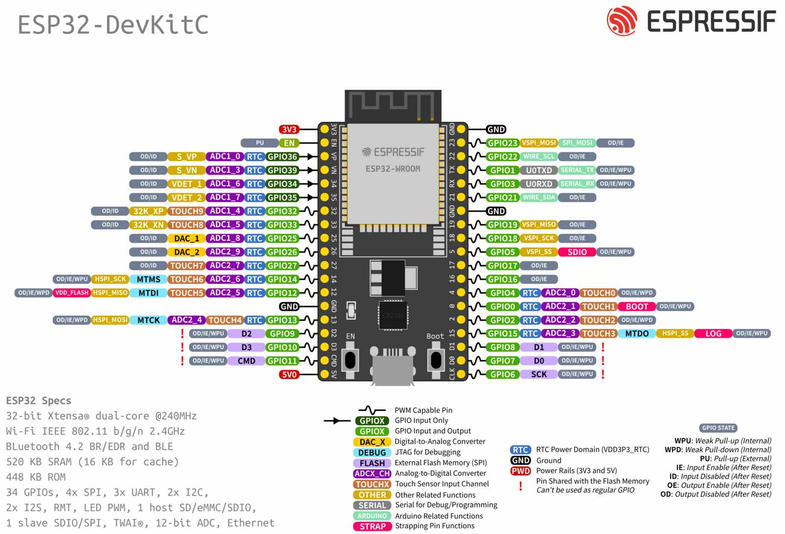

# hi
----

```cpp
//### ***"..." = your pin***
//> ## for work2
//>```cpp
//> #define ldr_work2 ...
//> const int led_work2[3] = {..., ..., ...};
//>```
//> ## for work3
//>> - ultrasonic use trig(16) & echo(17)
//>```cpp
//> const int led1_work3 = ...;
//> const int led2_work3 = ...;
//> const int led3_work3 = ...;
//> ```
//> ## for work4
//>> - ultrasonic use trig(16) & echo(17)
//>```cpp
//> const int servo_work4 = ...;
//>```
//> ## for work5
//>> - ultrasonic use trig(16) & echo(17)
//>
//>```cpp
//> const int potentio_work5 = ...;
//> LiquidCrystal lcd(Rs, E, D4, D5, D6, D7);
//>```
```
---


